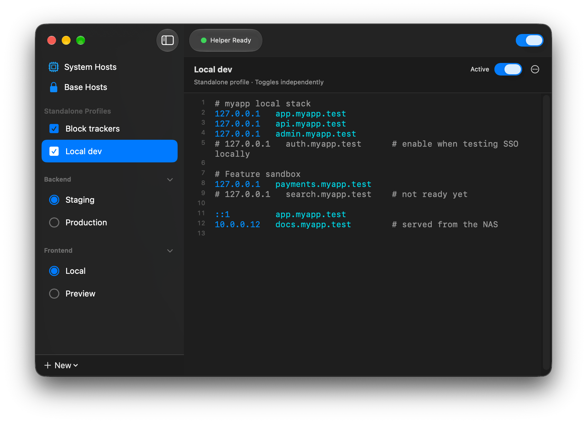
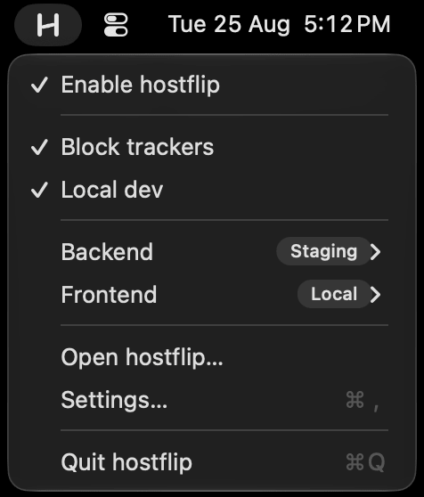
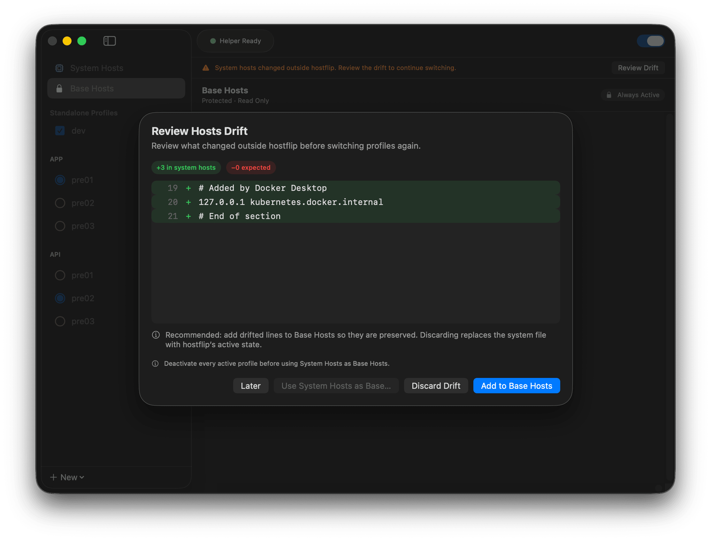

# hostflip

Native macOS hosts switcher. Flip between `/etc/hosts` profiles from your menu bar — no password prompt, no web view, no fuss.

**Free and open source (MIT).**

## Why hostflip

Most hosts managers treat `/etc/hosts` as their own: every save rewrites the whole file, and whatever else touched it is gone. hostflip is built around one idea: **the hosts file is yours**. It keeps your baseline intact, writes only inside its own fenced block, shows you a diff when something else changed the file — and once you approve its helper, every flip is a single click in the menu bar.

- **External edits are respected, not clobbered.** If anything else modifies `/etc/hosts`, hostflip detects the drift and walks you through reconciling it in a diff view before it writes again.
- **Your baseline is protected.** On first run, your current `/etc/hosts` is imported as the read-only *Base Hosts* — always applied first, never lost, and the original file is kept as a permanent backup.
- **A real activation model.** Profiles live in groups: at most one profile per group is active (mutually exclusive), while active profiles across groups and standalone profiles stack together into the final hosts file.
- **Zero-interruption switching.** A one-time approval of an embedded `SMAppService` daemon replaces per-switch password prompts.
- **Native and lightweight.** Swift + SwiftUI menu bar app. No web runtime, no background bloat.
- **Pause everything.** One master switch restores your baseline hosts while remembering every profile's state.
- **Switching from SwitchHosts? One click.** hostflip detects SwitchHosts data in any of its three generations (v3/v4/v5) and imports the lot: folders become groups, remote rules become Remote Profiles that keep refreshing on their own, and everything arrives inactive with a full summary of what came in, what was skipped, and what was adjusted. The [migration guide](docs/migrating-from-switchhosts.md) covers what carries over, what works differently, and the order of operations.

  

## Install

Requires macOS 14 or later on Apple silicon. Intel builds are not planned unless there is demand — if you need one, [open an issue](https://github.com/heronapp/hostflip/issues/new?title=Intel%20support).

**Homebrew**

    brew tap heronapp/tap
    brew trust heronapp/tap   # newer Homebrew requires trusting third-party taps once
    brew install --cask hostflip

This installs the app and puts the bundled `hostflip` command-line tool on your PATH.

**Direct download**

Grab the notarized DMG from [Releases](https://github.com/heronapp/hostflip/releases/latest) and drag `Hostflip.app` into `/Applications`. To use the `hostflip` command-line tool, symlink it out of the bundle:

    sudo mkdir -p /usr/local/bin
    sudo ln -sf /Applications/Hostflip.app/Contents/Helpers/hostflip /usr/local/bin/hostflip

## How it works

hostflip owns the whole `/etc/hosts` file and rewrites it atomically: Base Hosts first, then every active profile, each section clearly labeled. Writes go through a minimal root daemon whose XPC interface accepts exactly one operation — replace the hosts file with merged content — with code-signing verification on both sides of the connection. The daemon flushes the DNS cache after every write.

The first time you actually switch something, macOS asks you to approve the helper in System Settings. That's the only prompt you will ever see.

Technical deep-dives live in [`docs/`](docs/): signed-build verification, helper re-registration behavior, DNS flush measurements, and the release pipeline, all with reproducible steps.

## Command line

The bundle ships with a `hostflip` CLI ([Install](#install) covers how it gets on your PATH). It works on the same workspace and daemon as the app, so both can be used side by side:

    hostflip status                  # pause state, active profiles, hosts drift
    hostflip list                    # group structure, every profile with its ID
    hostflip activate staging/api    # switch, by name or group/profile path
    hostflip cat staging/api         # print a profile's content as stored
    hostflip write staging/api --file ./hosts.snippet
    hostflip refresh                 # re-fetch every remote profile (or name one)
    hostflip doctor dev.example.com  # diagnose one hostname, layer by layer

Profile names are not unique — IDs are; pass `--id` when a name is ambiguous. For scripting and agents, `--json` puts a result object on stdout and structured errors with stable string codes on stderr, and exit codes are meaningful — in particular `3` means the system hosts drifted and hostflip won't write until you reconcile in the app. `hostflip --help` lists the full command surface.

`hostflip refresh` reports its two layers separately: fetched content is always saved to the workspace (conditional requests keep unchanged sources cheap), while the system hosts is only rewritten when an active profile actually changed — a write blocked by drift or an unavailable daemon exits `3`/`4` with the fresh content kept, and `--json` carries a per-profile result for every source.

`hostflip doctor <hostname>` answers "why isn't my hosts entry working" in one pass: which profiles carry the name (and whether they're active), every mapping in the merged output, whether the system hosts file drifted, and what the system resolver actually returns — the resolver returns *all* matching entries, so the report compares sets instead of declaring a winner. When the system side is consistent, it tells you what to check next (browser DNS caches, connection pools, DNS-over-HTTPS). It's entirely read-only, works without the helper approved, and exits `7` when the diagnosis finds an inconsistency (`0` when everything agrees), so it drops straight into CI checks.

## FAQ

### I switched profiles, but my browser still resolves the old address

The system side is already complete — every write ends with a full DNS flush (`dscacheutil -flushcache` plus a `HUP` to `mDNSResponder`). What ignores it is the browser itself, in two layers: browsers keep a private DNS cache (roughly a minute), and — the bigger one — they keep established HTTP/2 and HTTP/3 connections alive for minutes. A reload rides an existing connection to the old address without resolving anything, which is why the behavior looks random and why restarting the browser "fixes" it. No hosts switcher can reach inside another process to clear these.

To pick up a switch without restarting the browser:

- **Chrome / Edge**: open `chrome://net-internals/#dns` (`edge://net-internals/#dns`) and click **Clear host cache**; then — the step that actually matters — `chrome://net-internals/#sockets` → **Flush socket pools**. A fresh incognito window also works: it gets its own DNS cache and connection pool (a plain new window shares them).
- **Firefox**: `about:networking#dns` → Clear DNS Cache. There is no UI for the connection pool, so a private window is the practical route.
- **Safari**: exposes neither; restart it or wait for idle connections to time out.
- DevTools' "Disable cache" does not help — it only affects the HTTP cache, not DNS or connection reuse.

To confirm the switch itself took effect, ask the system resolver directly: `dscacheutil -q host -a name your.host.name` — or run `hostflip doctor your.host.name`, which performs this check and the whole chain (profiles → merge → file → resolver) in one command. If the system resolver returns the new address, hostflip did its job and what you're seeing is browser-side.

One adjacent trap: with DNS-over-HTTPS enabled (Chrome's "Secure DNS", Firefox's TRR), some configurations bypass `/etc/hosts` entirely. That shows up as hosts entries *never* working — different from needing a browser restart.

### I clicked “Deactivate and Remove Helper”, but System Settings still lists Hostflip under App Background Activity

The button did complete its job: the helper is unregistered from the system's background-task records, it stops running, and nothing of hostflip launches in the background afterwards — the status light drops to “Helper Not Installed”, and your next profile switch simply requests the helper again.

The row under System Settings → General → Login Items & Extensions → App Background Activity belongs to macOS, not to the app. Its toggle records your permission for Hostflip to run background items, and macOS keeps showing the row while the app remains installed, whether or not anything is currently registered. Once you delete `Hostflip.app`, the row clears on its own (System Settings may need a relaunch, or occasionally a log-out, before it notices).

There is no supported command to remove a single app's row. The only lever macOS offers is `sudo sfltool resetbtm`, which wipes the background-item records of **every** app on the machine and makes each one re-prompt — a troubleshooting measure of last resort, not part of a normal uninstall.

## Updating

- Homebrew: `brew upgrade --cask hostflip`
- In-app: “Check for Updates” compares your version against the latest GitHub Release.

## Build from source

    swift build            # library & executables
    swift test             # test suite
    scripts/build-app.sh   # assemble Hostflip.app (ad-hoc signed without CODESIGN_IDENTITY)

An ad-hoc build verifies the packaging structure, but the XPC channel intentionally fails closed without a real Developer ID identity — see `docs/signed-build-verification.md`.

## Uninstall

Use “Deactivate and Remove Helper…” in the app first (unregisters the daemon), then delete `Hostflip.app`. `brew uninstall --zap --cask hostflip` also clears application data. The Hostflip row under App Background Activity in System Settings clears once the app is deleted — see the FAQ if it seems to linger.

Note that `/etc/hosts` keeps whatever hostflip last wrote — uninstalling does not rewrite it. Everything hostflip added sits in a clearly fenced block at the bottom of the file (`# ══ hostflip:begin … ══` through `# ══ hostflip:end ══`), so leftover entries are easy to spot and delete by hand. Better still, turn off the master switch **before** removing the helper: that restores the file to exactly your baseline hosts, with no hostflip traces at all — once the helper is gone, hostflip can no longer write the file. Your pre-hostflip hosts file is also preserved as `hosts.orig` in `~/Library/Application Support/hostflip` until that folder is zapped.

## About

hostflip is made by the developer of [Heron](https://getheron.app/), a paid macOS app for debugging iPhone web traffic. hostflip is MIT-licensed and standalone — it has no dependency on Heron.

## License

[MIT](LICENSE)
